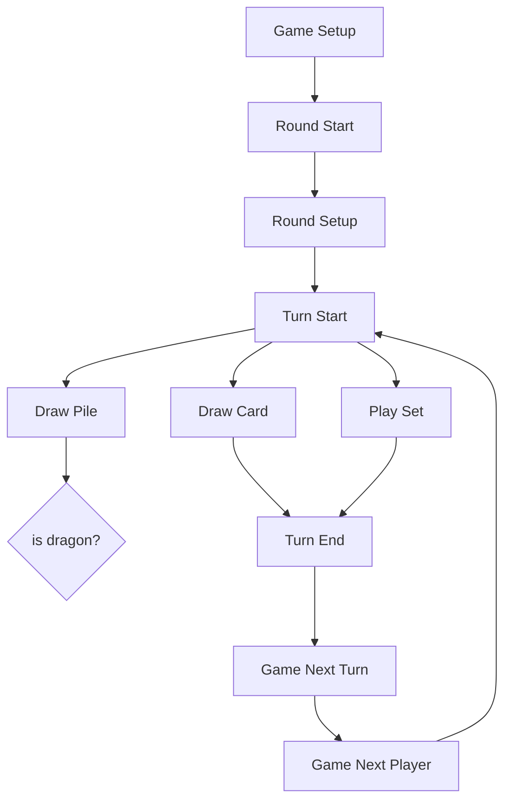

# Game Actions overviews

```mermaid
graph TD
  A[Game Setup] --> B[Round Start]
  B --> C[Round Setup]
  C --> I[Turn Start]
  I --> D[Draw Card]
  I --> E[Play Set]
  I --> F[Draw Pile]
  F --> K{is dragon?}
  D --> J[Turn End]
  E --> J
  J --> G[Game Next Turn]
  G --> H[Game Next Player]
  H --> I
```
